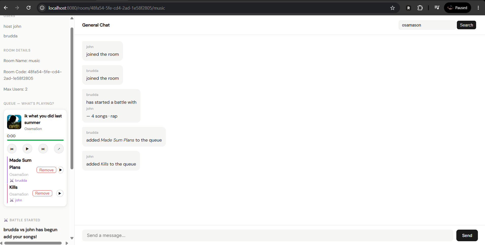

# Next on Aux
Next on Aux is a social music battle platform that lets you compete with friends like an "aux battle" to see who has the better taste in music. You are able create or join rooms, queue your favorite tracks, and battle it out in real-time as listeners vote for the songs they enjoy most.
With synchronized playback, everyone in the room listens to the same music at the same time, creating a shared listening experience no matter where they are.



---

## Key Features
- **Real-Time Synchronized Playback** — Listen together with friends in perfect sync.
- **Spotify Search** — Quickly search and add tracks directly from Spotify's extensive music catalog from the API.
- **Music Taste Battles** — Compete to see who has the best music taste.
- **Public & Private Rooms** — Create or join rooms instantly.
- **Live Voting** — Vote on songs and battle participants.
- **Live Leaderboards** — Track scores and rankings in real time.
- **Music Discovery** — Discover new songs through the community.
- **Responsive Design** — Works on desktop, tablet, and mobile.
- **Real-Time Experience** — Fast, interactive, and built for live engagement.

---

## Built with
### Frontend


### Core


### Backend & APIs


### Database


### Authentication & Security


---

## Setup Requirements (Spotify API)

This project uses the Spotify Web API, which requires a Spotify Developer account.

### 1. Create a Spotify Developer Account

To use the Spotify API, you need to register as a developer and have a spotify subscription:

- Go to the Spotify Developer Dashboard  
  https://developer.spotify.com/dashboard
- Log in with your regular Spotify account
- Accept the Developer Terms of Service if prompted

---

### 2. Create a New App

Once logged in:

- Click **“Create App”**
- Fill in the required details:
  - App Name: (your project name)
  - App Description: (optional)
- Set a **Redirect URI**, for example: http://127.0.0.1:8080/spotify/callback

---


## Getting Started
### Prerequisites

Make sure you have installed:

- Java 17+ (or your project version)
- Maven or Gradle
- A Spotify Developer account (for API access)

### Installation

1. **Clone the repository**
   ```bash
   git clone https://github.com/jonuoha60/Next-on-Aux.git
   cd NextOnAux
   ```

2. **Set up environment variables and application properties**
   
   Create a `.env` file in the server directory:
   ```env
    CLIENT_ID=
    CLIENT_SECRET=
    SPOTIFY_REDIRECT_URI=http://127.0.0.1:8080/spotify/callback
   ```
   In application properties fill these values from firebase 
    ```env
    firebase.apiKey=
    firebase.authDomain=
    firebase.projectId=
    firebase.appId=
    ```
4. **Start the development servers**
   
   Backend:
   ```bash
   mvn spring-boot:run
   ```
   
5. **Access the app**
   
   Frontend:
   ```bash
   http://localhost:8080
   ```
   
---

## Project Structure 
   ```bash
  DEMO
  │
  ├── src
  │ ├── main
  │ │ ├── java
  │ │ │ └── com
  │ │ │ └── example
  │ │ │ └── demo
  │ │ │ ├── controller
  │ │ │ ├── config
  │ │ │ ├── helper
  │ │ │ ├── model
  │ │ │ ├── repo
  │ │ │ ├── service
  │ │ │ └── DemoApplication.java
  │ │ │
  │ │ └── resources
  │ │ ├── static
  │ │ │ ├── css
  │ │ │ │ ├── create.css
  │ │ │ │ ├── login.css
  │ │ │ │ ├── room.css
  │ │ │ │ └── style.css
  │ │ │ │
  │ │ │ └── js
  │ │ │ ├── main.js
  │ │ │ └── room.js
  │ │ │
  │ │ ├── templates
  │ │ │ ├── create.html
  │ │ │ ├── explore.html
  │ │ │ ├── home.html
  │ │ │ ├── join.html
  │ │ │ ├── login.html
  │ │ │ ├── room.html
  │ │ │ └── signup.html
  │ │ │
  │ │ ├── application.properties
  │ │ └── schema.sql
  ```

## Usage

1. **Sign up / log in** with email or Google OAuth.
2. **Create or join a room** — public or private.
3. **Queue tracks** using Spotify search.
4. **Battle** — listen in sync and vote live on each track.
5. **Check the leaderboard** to see who's winning.

## License

Distributed under the MIT License. See `LICENSE` for more information.

